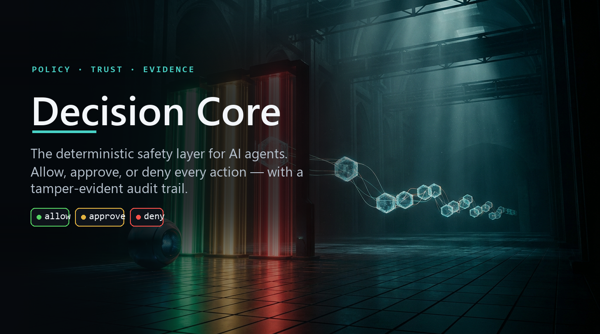
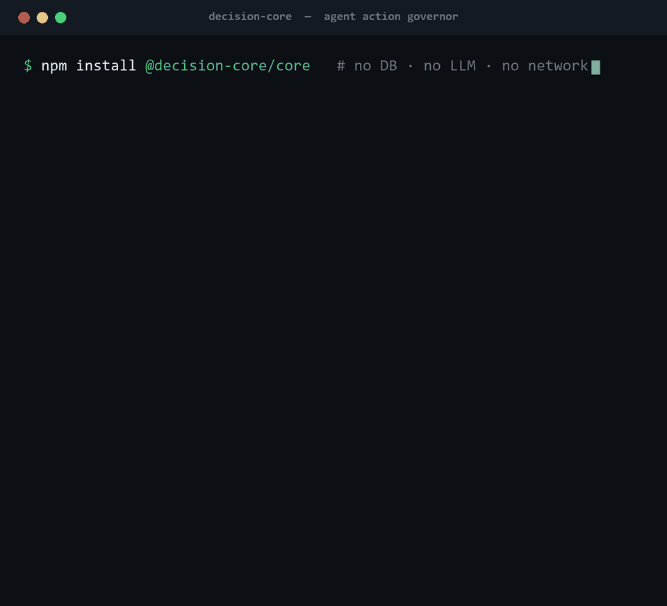
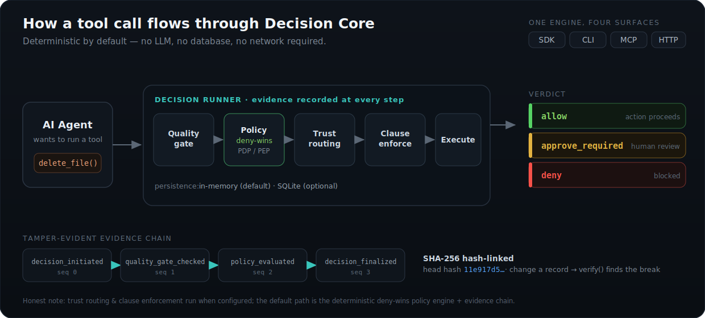

<p align="center">
  
</p>

<p align="center">
  
  
  
  = 20">
  
  
</p>

<p align="center"><b>Govern what your AI agent can do — <i>before</i> it acts — and keep a tamper-evident record of every decision.</b></p>

---

Your agent can delete data, move money, deploy, or leak secrets. Most setups have **no brakes and no record**.

**Decision Core** sits between your agent and its tools and enforces policy on every action — returning
**`allow`**, **`approve_required`**, or **`deny`** — then writes a **SHA-256 hash-linked audit record** you can
verify later. It's deterministic: **no database, no LLM, and no network are required.** The whole engine runs
in-process from four small libraries, or as an MCP server, over HTTP, or from the CLI.

The scary part of dropping a policy engine in front of a live agent is *what if it blocks the wrong thing?*
So adoption is **observe-first**: install in watch mode, see exactly what enforcement *would* have blocked,
then flip on real blocking with one command.

<p align="center">
  
</p>
<p align="center"><sub>↑ Real CLI output. <code>read_file</code> → allow · <code>delete_user</code> → approve · unknown tool → deny. Every decision is logged and hash-linked.</sub></p>

## Why it exists

Content guardrails check *what the model says*. Decision Core governs *what the agent does* — and proves it.

- **A real gate, not a logger.** Deny-wins arbitration: if any rule says deny, the action is denied — no ambiguity, no model in the loop.
- **Adopt without breaking anything.** Observe mode records what it *would* block while blocking nothing, so you onboard a running agent with zero risk.
- **Tamper-evident by construction.** Every step of a decision is a hash-linked evidence record; change one byte and `verify()` pinpoints the break.
- **Boringly portable.** In-memory by default. No infra to stand up, nothing to page you at 3am. Drop it into one process or run it as a service.

## Features

| | |
|---|---|
| **Deny-wins policy engine** | A deterministic PDP/PEP: glob-matched rules resolve to `allow` / `approve_required` / `deny`, and any deny wins. No LLM, no flakiness. |
| **Observe-first onboarding** | `setup → observations → enforce`. Watch what *would* be blocked (redacted — no tool args), review impact, then promote to enforcement with a backed-up, validated config. |
| **Tamper-evident evidence chains** | Each decision emits SHA-256 hash-linked records (`auditHash = hash(sequence ‖ previousHash ‖ payloadHash ‖ op)`). `verifyChain()` detects and locates tampering. |
| **Approval workflows** | Risky actions escalate to `approve_required` (human review) instead of hard-failing, with separation-of-duties on resolution. |
| **Policy packs** | Pre-built YAML rule sets — `personal`, `team`, `fintech`, `healthcare`, `saas` — loadable and customizable; a linter and conflict analyzer catch contradictions before they ship. |
| **Four surfaces, one engine** | The same core runs as an **SDK**, a **CLI**, an **MCP server** (for IDEs/agents), and an **HTTP** service. |
| **Tenant isolation** | Every record and rule is partitioned by `tenantId`; the HTTP server (org mode) binds each request to the authenticated token's tenant, never the request body. |
| **Zero mandatory infra** | Runs entirely in memory. Optional SQLite for durable logs degrades gracefully if the native binding isn't present. |

## How it works

<p align="center">
  
</p>

A tool call enters the **Decision Runner**, which evaluates it through a deterministic pipeline and records an
evidence entry at every step. The default path is the **deny-wins policy engine + evidence chain**; trust routing
and clause enforcement engage when you configure them.

## Quickstart

### Option A — the SDK (60 seconds)

```bash
npm install @decision-core/core
```

```typescript
import { quickStart, ActionApprovalDecision } from '@decision-core/core';

// Declare the tools your agent may use. Anything unlisted is denied by default.
const dc = await quickStart({ tools: ['read_*', 'write_*', 'search_*'] });

const result = await dc.evaluate(
  new ActionApprovalDecision('delete_file').withInputProvider(() => ({
    actionName: 'delete_file',
    actionParams: { path: '/data/report.csv' },
    requestedBy: 'agent-1',
    riskIndicators: ['destructive'],
  })),
);

console.log(result.verdict);                   // → 'blocked'  (no allow rule matched → deny-unknown)
console.log(result.evidenceChain.recordCount); // → 4
console.log(result.evidenceChain.headHash);    // → '11e917d5…'  (SHA-256 head of the chain)

const why = await dc.explain(result.correlationId);
console.log(why.summary);          // → "Decision denied by policy rule(s): deny-unknown-default."
console.log(why.evidenceSummary);  // → "4 evidence record(s) in chain; … head hash: 11e917d5…"
```

> The output above is copied from a real run. Need a one-liner gate without the full pipeline?
> `await evaluate({ action: 'delete_file', surface: 'api' }, { denyUnknownDefault: true })` returns `{ decision: 'deny' }`.

### Option B — the CLI (observe-first)

```bash
npm install @decision-core/core

npx decision-core init --profile team   # writes config + policy pack, deny-unknown ON
npx decision-core doctor                 # health check + tells you observe vs enforce
npx decision-core evaluate --action delete_user   # → approve_required
npx decision-core evaluate --action read_file     # → allow
```

To onboard a **live** agent safely, install in observe mode and review before enforcing:

```bash
npx decision-core setup            # detects your tools, installs in OBSERVE mode (blocks nothing)
# ... run your agent normally ...
npx decision-core observations --recommend   # see what enforcement WOULD have blocked
npx decision-core enforce          # turn on real blocking (backs up + validates the config)
```

### Option C — MCP server

```bash
npx decision-core serve --mcp
```

Exposes read-only policy tools (`evaluate`, `query_policy`, `explain_decision`, `audit_trail`, `dc_observations`, …)
to any MCP client. Policy-**mutating** tools are off by default and require explicit opt-in.

## The part you'll actually brag about: verifiable audit

Every decision produces a hash-linked chain. Tampering with any record breaks every record after it, and
verification tells you exactly where:

```typescript
const result = await dc.evaluate(decision);

result.evidenceChain.recordCount; // 4
result.evidenceChain.headHash;    // 'a1b2c3…'  SHA-256 head of the chain
result.auditHash;                 // SHA-256 of the decision payload
result.correlationId;             // trace id linking every evidence record

// Each record: auditHash = SHA-256(sequence ‖ previousHash ‖ payloadHash ‖ operationType)
// EvidenceChainService.verify() walks the chain and reports the first broken record.
```

This is the difference between "we log decisions" and "we can prove decisions weren't altered." See the
[Evidence Chain Guide](docs/EVIDENCE-CHAIN-GUIDE.md).

## Decision Core vs. content guardrails

Decision Core is **complementary** to validation libraries — it governs *actions*, they validate *text*. Use both.

| | **Decision Core** | Guardrails AI / NeMo Guardrails |
|---|---|---|
| **Scope** | Should this **action** run at all? | Is this model **input/output** safe? |
| **Engine** | Deny-wins PDP/PEP, deterministic | Validators / dialog rails |
| **Policy as data** | Hot-reloadable YAML packs | Python validators / Colang |
| **Approval workflows** | Built-in escalation to humans | Not built-in |
| **Audit** | Hash-linked, tamper-evident chains | Logging only |
| **Historical replay** | Replay with point-in-time policy | — |
| **LLM required** | No — core is fully deterministic | Often yes |
| **Database required** | No — in-memory default | Varies |
| **MCP server** | Built-in | — |

**What Decision Core deliberately does *not* do:** content filtering, prompt engineering, agent orchestration,
or secret storage. Pair it with a content-guardrails library for input/output safety.

## Status & honesty

This project keeps a single source of truth — [`docs/STATUS-LEDGER.md`](docs/STATUS-LEDGER.md) — that **wins over
any marketing language, including this page.** The short version:

- **Proven & tested today:** SDK · CLI · MCP · HTTP surfaces · deny-wins policy engine · observe→enforce
  onboarding · tamper-evident evidence chains · tenant isolation · the **Hermes** Python-runtime integration
  (verified end-to-end through Hermes's real tool-dispatch path).
- **Optional / runs when configured:** SQLite persistence, trust routing & model-assisted decision patterns,
  G-Brain evidence sink.
- **Experimental:** the **OpenClaw** TypeScript-runtime adapter (not yet proven through a full agent loop — run it `failMode: 'closed'`).
- **Not shipped:** any Postgres/managed-persistence tier.

> **Default posture, stated plainly:** with no policy pack loaded and `denyUnknownDefault` unset, an unmatched
> action is **allowed** — deny-unknown is opt-in (the quick starts above enable it). Load a pack or set the flag
> before relying on deny-wins for unknown actions.

The library is **pre-1.0 (v0.1)** and not yet published to npm; the public release is a deliberate, separate step.

## Docs

| | |
|---|---|
| [Full usage guide](docs/USAGE.md) | Personal / Team / Enterprise setups, full CLI reference, org mode |
| [Architecture](docs/ARCHITECTURE.md) | The pipeline, surfaces, and persistence in depth |
| [Policy authoring](docs/POLICY-AUTHORING-GUIDE.md) | Writing rules, packs, and structured clauses |
| [Evidence chains](docs/EVIDENCE-CHAIN-GUIDE.md) | How hash-linking and verification work |
| [Trust routing](docs/TRUST-ROUTING-GUIDE.md) | Surfaces, tiers, and decision patterns |
| [Hermes integration](docs/INTEGRATION-GUIDES/hermes.md) | The proven end-to-end drop-in |
| [Status ledger](docs/STATUS-LEDGER.md) | What's proven vs. experimental — the source of truth |

## Requirements

- **Node.js ≥ 20**
- Runtime libraries: `zod`, `pino`, `yaml`, `@modelcontextprotocol/sdk` — **no database, no LLM, no network.**
- Optional: `better-sqlite3` for durable logs (degrades gracefully if absent).

## Contributing

```bash
npm install
npm test          # vitest
npm run typecheck
npm run lint
```

Tests live next to source (`foo.ts` → `foo.test.ts`). Every repository method takes `tenantId` first; every
evidence record carries `correlationId`, `timestamp`, `tenantId`, and `auditHash`. See
[CONTRIBUTING.md](CONTRIBUTING.md).

## License

[MIT](LICENSE) © Blockbrain Labs
